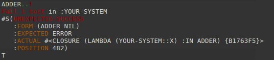

# JINGOH 0.0.0
*NOTE!* Jingoh is very personal products, so use your own risk.
Other products (if any) are strongly recommended.

## What is this?
DSL to notate specification, rather than test framework.

## Notable differences from other test suites.
* Specification notation rather than test framework.
* Readability oriented syntax rather than writablility.
* Including specification template (i.e. as test template).
* Including from-spec(i.e. test)-file-to-HTML converter.
* Including from-spec(i.e. test)-file-to-github-wiki converter.
* Customizable issue printer.

* Support coloring printing.
* Support S-Expression-equal. (alpha quality.)
* Support parallel testing.
* Including project skelton generator.

## How to use.
### Initialization
If your system is already made, evaluate below.

*NOTE!* You must specify your system with *keyword*.

```lisp
(asdf:load-system :jingoh.generator)
(jingoh.generator:generate :your-system)
```
In this case, jingoh will make `spec` subdirectory in your system source directory like below.

```
your-system/
  |--- your-system.asd
  |--- your-system.lisp
  |--- spec/
        |--- your-system.test.asd
        |--- your-system.lisp
```

Else if your system is not made yet, specify `:init` keyword with T.

```lisp
(jingoh.generator:generate :your-system :init t)
```
In this case, jingoh works like project skeleton generator (e.g. quick-project.).

```
your-system/
  |--- README.md
  |--- spec/
        |--- your-system.lisp
        |--- your-system.test.asd
  |--- src/
        |--- your-system.lisp
  |--- your-system.asd
```
In both cases, test is already setup.
To run test, evaluate like below.

```lisp
(asdf:test-system :your-system)
```

### Writing specifications.
Let's say your-system has function like below.

```lisp
(defun adder(num)
  "Make adder function."
  (lambda(x)
    (+ x num)))
```
To add specification of ADDER to your spec file, evaluate like below.

```lisp
(jingoh.generatoer:generate 'your-system::adder)
```
Jingoh appends spec file with template like below.

```
(requirements-about ADDER)

;;;; Description:
; Make adder function.

#+syntax
(ADDER num) ; => result

;;;; Arguments and Values:

; num := 

; result := 

;;;; Affected By:

;;;; Side-Effects:

;;;; Notes:

;;;; Exceptional-Situations:

```
This template is designed to be same with hyper-spec.

Then, writing specs.
To write comment, use markdown syntax with semicolon escape.
To know completed syntax, see [SYNTAX.md](SYNTAX.md).
One-sentence-some-examples style is recommended.

```lisp
(requirements-about ADDER)

;;;; Description:
; Make adder function.
#?(adder 1) :be-the function

; Apply number to returned function, such function return added value.
#?(funcall(adder 1)2) => 3

#+syntax
(ADDER num) ; => result

;;;; Arguments and Values:

; num := number which is acceptable for `CL:+`, otherwise error
#?(adder nil) :signals error

; result := function as `(FUNCTION(NUMBER)NUMBER)`

;;;; Affected By:
; none

;;;; Side-Effects:
; none

;;;; Notes:

;;;; Exceptional-Situations:
```

### Running test.
*NOTE!* Before running test, do not forget export (if it will be exported.) symbol from your system package, or import  (if it will be internals.) symbol from your system package to spec package.

```lisp
(asdf:test-system :your-system)
```



### Modifying.
In the example above, test is failed because `ADDER` does not check argument type.
So, modify source like below.

```lisp
(defun adder(num)
  "Make adder function."
  (check-type num number)
  (lambda(x)
    (+ x num)))
```


### Documentization
After writing your-system's spec file, if you want to get your system's html documentations, evaluate like below.

```lisp
(asdf:load-system :jingoh.documentizer)
(jingoh.documentizer:documentize :your-system)
```
Jingoh will make `doc` subdirectory in your system source directory.

If you want provide such documentations as github wiki, after clone github wiki repository, evaluate like below.

```lisp
(jingoh.documentaizer:github :your-system "path/to/your-system.wiki/")
```
Then push it.

### Parallel testing.
Normally, jingoh run tests sequentially.
If you want to run tests in parallel, modify `spec/your-system.test.asd` like below.

```lisp
(defsystem :your-system.test
  :depends-on (:jingoh.parallel ; <--- instead of :jingoh
               "your-system")
  :components ((:file "your-system"))
  :perform
  (test-op(o c)(symbol-call :jingoh.parallel ; <--- instead of :jingoh
                            :pexamine ; <--- instead of :examine
                            :your-system)))
```
*NOTE!* Parallelizing has its own overhead, so parallel testing may slower than sequential testing.
## From developer

### Product's goal
?
### License
MIT
### Developed with
SBCL
### Tested with
CCL, ECL
#### About CLISP
Jinogh.documentizer depends on `3bmd`, and `3bmd` does not work in clisp, so jingoh.documentizer also does not work in clisp.

My local clisp does not have multithread option, so jingoh.parallel is not tested in clisp.

Jingoh and jingoh.generator are tested and works as well in clisp.

## Installation
TODO
